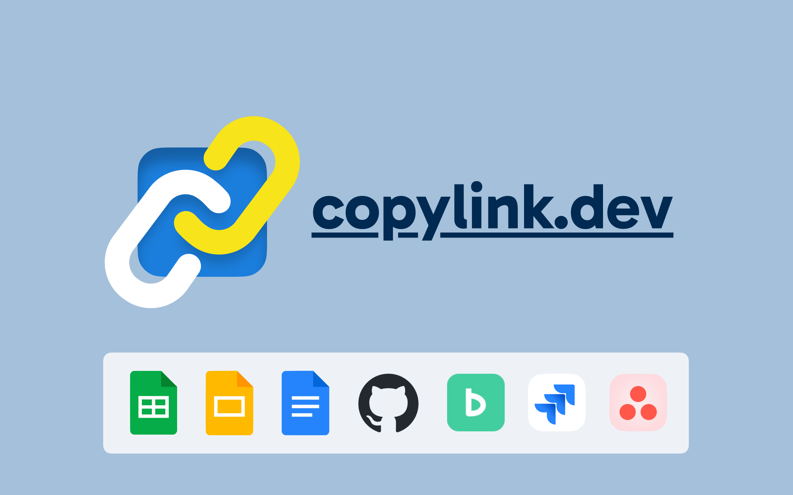

[English](./README.md)

[UserScript 版はこちら](https://github.com/wintorse/copylink-dev-user-js)

> [!NOTE]
> **Arc ブラウザをご利用の方へ**: 2025年5月頃から、Arc ブラウザでキーボードショートカットが動作しなくなりました。ショートカットを「グローバル」モードに設定することで解決できます:
> 1. 拡張機能アイコンを右クリック → 「拡張機能を管理」
> 2. 「キーボードショートカット」に移動
> 3. 各ショートカットを「グローバル」モードに設定
>
> ⚠️ **注意**: グローバルショートカットは他のアプリケーションのショートカットと競合する可能性があります。
>
> グローバルショートカットを使用したくない場合は、[UserScript 版](https://github.com/wintorse/copylink-dev-user-js)をご利用ください。

# copylink.dev

  

ショートカットでタイトルつきのリンクをコピーするブラウザ拡張機能。

一部サイトではタイトルの整形や Slack 絵文字にも対応。

## 機能

<video src="docs/simple-demo-jp.mp4" title="demo video of copylink.dev"></video>

「[◯◯◯◯設計書](https://example.com)」のような、タイトルのついたリンク（テキストリンク）をクリップボードにコピーするショートカットを提供します。

Slackなどにペーストすることで可読性の高いリンクを手早く作成できます。
また、素の URL と異なりタイトルで検索した際にもヒットするため、検索性を向上できます。

特に以下のサイトでは、タイトルを整形する機能を備えています。
また Slack ユーザー向けに Slack 絵文字とともにコピーすることもできます。

- Google スプレッドシート / ドキュメント / スライド
- Google ドライブ
- GitHub Pull Request / Issue
- Jira 課題
- Asana タスク
- Backlog 課題
- Redmine チケット
- ReDoc

加えて、Google スプレッドシートでは選択した範囲へのリンクを Slack 絵文字とともにコピーすることができます。

なお、設定画面からお好みのサイトの URL を正規表現で指定し、絵文字を設定できます(例: `www\.example\.com`)。

その他のサイトでは、`document.title` （ブラウザのタブに表示されるタイトル）のついたリンクをコピーします。

## インストール - Chrome

[Chrome ウェブストア](https://chromewebstore.google.com/detail/ohkebnhdjdgmfnhcmdpkdfddongdjadp)からインストール

またはリリースからインストール：

1. [Releases](https://github.com/wintorse/copylink-dev/releases/latest) ページから最新の zip ファイルをダウンロードして解凍する
2. [chrome://extensions/](chrome://extensions/) にアクセスする
3. 右上の「デベロッパーモード」を有効にする
4. 「パッケージ化されていない拡張機能を読み込む」をクリックし、解凍したフォルダを選択する

またはソースコードからビルド：

1. このリポジトリをクローンする
2. `npm i` で開発依存関係をインストールする
3. npm run build を実行する
4. [chrome://extensions/](chrome://extensions/) にアクセスする
5. 右上の「デベロッパーモード」を有効にする
6. 「パッケージ化されていない拡張機能を読み込む」をクリックし、`dist` フォルダを選択する

## インストール - Firefox

[Firefox Browser Add-Ons](https://addons.mozilla.org/firefox/addon/copylink-dev/) からインストール

またはリリースからインストール：

1. [Releases](https://github.com/wintorse/copylink-dev/releases/latest) ページから最新の Firefox 向け zip ファイルをダウンロードして解凍する
2. [デバッガーページ](about:debugging#/runtime/this-firefox) にアクセスする
3. 「一時的なアドオンを読み込む…」をクリックし、解凍したフォルダ内の任意のファイルを選択する

またはソースコードからビルド：

1. このリポジトリをクローンする
2. `npm i` を実行して依存関係をインストールする
3. `npm run build-firefox` を実行する
4. [デバッガーページ](about:debugging#/runtime/this-firefox) にアクセスする
5. 「一時的なアドオンを読み込む…」をクリックし、dist フォルダ内の任意のファイルを選択する

## 使い方

1. サイトで以下のショートカットを実行する
2. お使いの各種ツール（Slack など）にペーストする

| 機能                               | Mac            | Windows       |
| ---------------------------------- | -------------- | ------------- |
| リンクをコピー                     | `Ctrl+L`       | `Alt+L`       |
| リンクをコピー（Slack 絵文字つき） | `Ctrl+Shift+L` | `Alt+Shift+L` |
| タイトルをコピー                   | `Ctrl+T`       | `Alt+T`       |

ショートカットは[設定](chrome://extensions/shortcuts)から変更できます。

Slack 絵文字名の変更は拡張機能アイコンをクリックして行えます。

## ライセンス

MIT
