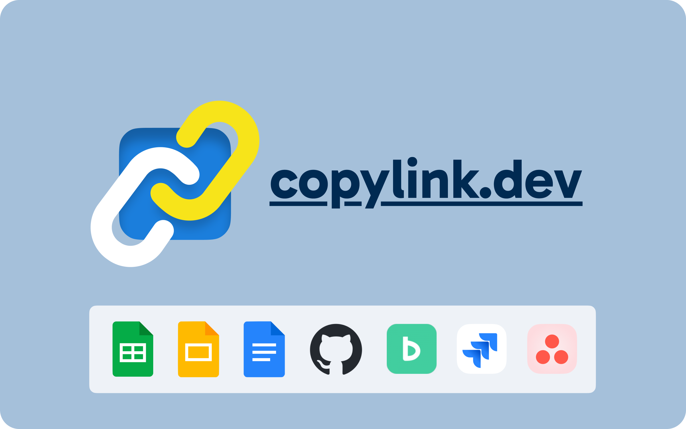

[日本語版 README はこちら](./README-ja.md)

[Also available as a UserScript!](https://github.com/wintorse/copylink-dev-user-js)

> [!NOTE]
> **For Arc Browser Users**: Since around May 2025, keyboard shortcuts stopped working in Arc browser.
>
> Please use the [UserScript version](https://github.com/wintorse/copylink-dev-user-js) instead.
>
> _For developers:_ If host permission is granted, this extension works, but only when the shortcuts are set to "Global" mode.
> Note: Global shortcuts may conflict with shortcuts in other applications.
>
> [Build with host permissions](#build-with-host-permissions-chrome--arc), install it, and configure the shortcuts.

# copylink.dev

<p align="center">
  
</p>

A browser extension that copies text links to clipboard with shortcuts.

On supported websites, title formatting and Slack emoji-enhanced links are available.

## Features

<div align="center">
  <video controls src="https://github.com/user-attachments/assets/446772c6-889b-45f0-84bf-1e8c2734b4cb" width="480" title="Demo"></video>
</div>
<br>

Provides shortcuts to easily copy text links with titles, such as "[My spreadsheet](https://example.com)".

You can quickly create highly readable links by pasting them into Slack or some other platforms.

Also, unlike plain URLs, they will show up when searching by title, which improves searchability.

For the following sites, it has the functionality to format titles and also copy links with Slack emojis for pasting into Slack:

- Google Sheets / Docs / Slides
- Google Drive
- GitHub Pull Request / Issue
- Jira Issue
- Asana Task
- Backlog Issue
- Redmine Issue
- ReDoc

Additionally, this extension allows you to copy a link to a selected range in Google Sheets along with a Slack emoji.

You can also specify the URL of your preferred sites using regular expressions and set emojis from the settings screen (e.g., `www\.example\.com`).

For other sites, it copies links with `document.title`, which is the title of the current webpage.

## Installation - Chrome

Install from [Chrome Web Store](https://chromewebstore.google.com/detail/ohkebnhdjdgmfnhcmdpkdfddongdjadp)

Or install from Release:

1. Download and unzip the latest zip file from [Releases](https://github.com/wintorse/copylink-dev/releases/latest)
2. Go to [chrome://extensions/](chrome://extensions/)
3. Enable "Developer mode" in the top right corner
4. Click "Load unpacked" and select the unzipped folder

Or build from the source code:

1. Clone this repository
2. Run `pnpm i` to install dev dependencies
3. Run `pnpm run build`
4. Go to [chrome://extensions/](chrome://extensions/)
5. Enable "Developer mode" in the top right corner
6. Click "Load unpacked" and select the `dist` folder

### Build with host permissions (Chrome / Arc)

After cloning the repository and running `pnpm i`, run the following instead of the usual `pnpm run build`:

```sh
pnpm run build:with-host-permissions
```

This adds `host_permissions: ["<all_urls>"]` to the generated `dist/manifest.json`, requesting host access to all sites. Load the `dist` folder using the steps above. If the extension is already loaded, reload it from the extension management page.

In Arc, also set each shortcut to "Global" mode in the extension shortcut settings.

The usual `pnpm run build` does not add host permissions. To return to the usual build, run it again and reload the extension.

## Installation - Firefox

Install from [Firefox Browser Add-Ons](https://addons.mozilla.org/firefox/addon/copylink-dev/)

Or install from Release:

1. Download and unzip the latest zip file from [Releases](https://github.com/wintorse/copylink-dev/releases/latest)
2. Go to [Debugger page](about:debugging#/runtime/this-firefox)
3. Click "Load Temporary Add-on…" and select any file in the unzipped folder

Or build from the source code:

1. Clone this repository
2. Run `pnpm i` to install dev dependencies
3. Run `pnpm run build-firefox`
4. Go to [Debugger page](about:debugging#/runtime/this-firefox)
5. Click "Load Temporary Add-on…" and select any file in the `dist` folder

## Usage

1. Execute the following shortcuts on website
2. Paste into your tools (e.g., Slack)

| Function                                          | Mac            | Windows       |
| ------------------------------------------------- | -------------- | ------------- |
| Copy link                                         | `Ctrl+L`       | `Alt+L`       |
| Copy link with Slack emoji                        | `Ctrl+Shift+L` | `Alt+Shift+L` |
| Copy title                                        | `Ctrl+T`       | `Alt+T`       |
| Copy link to selected range <br>in Google Sheets™ | `Ctrl+R`       | `Alt+R`       |

Shortcuts can be changed from [Extension Settings](chrome://extensions/shortcuts).

You can set Slack emojis and Google Sheets™ range link format by clicking the extension icon.

## License

MIT
